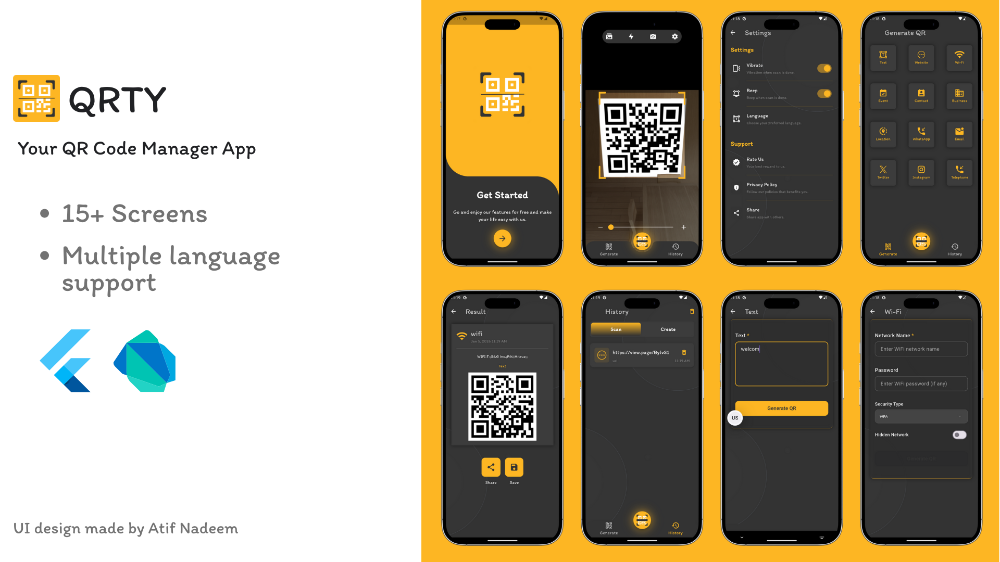

# QRTY - Ultimate QR Code Manager

QRTY is a comprehensive and modern Flutter application designed to handle all your QR code needs. Whether you need to scan a code instantly, generate a new one for your business, or keep a history of your interactions, QRTY provides a seamless and efficient experience.

## 🚀 Why QRTY?

QRTY combines performance with a user-friendly interface to offer the best QR code management experience on mobile.

*   **⚡ Instant Scanning**: Built with `mobile_scanner` for lightning-fast QR code detection.
*   **🛠️ Versatile Generation**: Create QR codes for various data types using `qr_flutter`.
*   **💾 Local History**: Never lose a code again. All scans and generations are saved locally using the high-performance `ObjectBox` database.
*   **🌍 Global Ready**: Fully localized with `easy_localization` to support multiple languages.
*   **🎨 Beautiful Design**: Features a polished UI with `animated_bottom_navigation_bar` and smooth transitions.
*   **⚙️ Customizable Experience**: Toggle vibration, sound effects, and manage app preferences easily.

## 📸 App UI



## 🎨 Design Credit

The UI design of this application is based on the work of **Atif Nadeem**.
[View the design on Figma](https://www.figma.com/community/file/1214837612730924876)

## 📂 Folder Structure

The project follows MVVM approach, separating concerns for better maintainability

```
lib/
├── core/                   # Shared resources and utilities
│   ├── common/             # Common widgets and constants
│   ├── routes/             # Navigation configuration
│   ├── services/           # Global services
│   ├── storage/            # Database configuration
│   └── theme/              # App theming and styles
├── feature/                # Feature-based modules
│   ├── app_section/        # Main app container/navigation
│   ├── generate_qr/        # QR Generation logic and UI
│   ├── history/            # History management
│   ├── scan_qr/            # QR Scanning implementation
│   ├── settings/           # App settings
│   └── splash/             # Splash screen
├── l10n/                   # Localization files
└── main.dart               # Application entry point
```

## 🛠️ Technologies Used

This project leverages a robust stack of Flutter packages and tools:

*   **Framework**: [Flutter](https://flutter.dev/) & [Dart](https://dart.dev/)
*   **State Management**: [flutter_bloc](https://pub.dev/packages/flutter_bloc) (BLoC Pattern)
*   **Database**: [objectbox](https://pub.dev/packages/objectbox) (High-performance NoSQL database)
*   **Scanning**: [mobile_scanner](https://pub.dev/packages/mobile_scanner)
*   **Generation**: [qr_flutter](https://pub.dev/packages/qr_flutter)
*   **Localization**: [easy_localization](https://pub.dev/packages/easy_localization)
*   **Navigation**: Custom Route Generation with Animations
*   **Utilities**: `share_plus`, `url_launcher`, `image_gallery_saver_plus`, `vibration`, `audioplayers`

## 🔄 GitHub Workflow

We follow a structured workflow to ensure code quality and stability:

1.  **`main` Branch**: The stable production-ready code.
2.  **Feature Branches**: New features are developed in separate branches (e.g., `feature/new-scanner`).
3.  **Refactor Branches**: Code improvements and architectural changes (e.g., `refactor/mvvm`).
4.  **Pull Requests**: All changes are reviewed via Pull Requests before merging into `main`.

## 🧠 Skills Learned

Building QRTY involved mastering several key software engineering concepts:

*   **MVVM/BLoC Architecture**: Implementing a scalable and testable app architecture.
*   **Local Data Persistence**: integrating and managing a NoSQL database with ObjectBox.
*   **Hardware Integration**: Handling camera permissions and streams for scanning.
*   **Internationalization**: Setting up a robust localization system.
*   **State Management**: Managing complex app states efficiently with Cubits and Blocs.

## 🎥 Video Demo

*(Placeholder: Link to a video demonstration of the project in action)*

## 🏁 Getting Started

Follow these steps to run the project locally:

### Prerequisites

*   [Flutter SDK](https://docs.flutter.dev/get-started/install) installed
*   Android Studio or VS Code configured for Flutter development

### Installation

1.  **Clone the repository**
    ```bash
    git clone https://github.com/Clark605/qrty.git
    cd qrty
    ```

2.  **Install dependencies**
    ```bash
    flutter pub get
    ```

3.  **Generate code (for ObjectBox and Localization)**
    ```bash
    flutter pub run build_runner build --delete-conflicting-outputs
    ```

4.  **Run the app**
    ```bash
    flutter run
    ```

---
*Built with ❤️ by Clark605*
